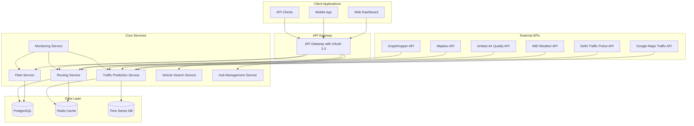

# Design Document

## Overview

The logistics routing system is designed as a microservices architecture that leverages OR-Tools for Vehicle Routing Problem (VRP) solving, integrates multiple external APIs for traffic prediction and mapping, and provides real-time fleet management capabilities. The system focuses on traditional optimization algorithms while maintaining scalability, security, and operational robustness for Delhi-specific logistics operations.

## Architecture

### High-Level Architecture



### Service Architecture Pattern

The system follows a microservices architecture with:
- **API Gateway**: Centralized entry point with authentication, rate limiting, and request routing
- **Service Mesh**: Inter-service communication with load balancing and circuit breakers
- **Event-Driven Architecture**: Asynchronous communication for real-time updates
- **CQRS Pattern**: Separate read and write models for optimal performance

## Components and Interfaces

### 1. Fleet Service

**Responsibilities:**
- Vehicle registration and management
- Real-time location tracking
- Compliance status monitoring
- Buffer vehicle allocation

**Key Interfaces:**
```typescript
interface Vehicle {
  id: string;
  type: VehicleType;
  capacity: {
    weight: number;
    volume: number;
  };
  location: GeoLocation;
  status: VehicleStatus;
  compliance: ComplianceInfo;
  lastUpdated: Date;
}

interface FleetService {
  registerVehicle(vehicle: Vehicle): Promise<void>;
  updateVehicleStatus(id: string, status: VehicleStatus): Promise<void>;
  getAvailableVehicles(criteria: SearchCriteria): Promise<Vehicle[]>;
  allocateBufferVehicle(hubId: string): Promise<Vehicle>;
}
```

### 2. Routing Service

**Responsibilities:**
- OR-Tools VRP solver integration with Delhi-specific constraints
- Route optimization considering vehicle class restrictions
- Hub-and-spoke routing logic with time window enforcement
- Real-time route updates and compliance validation

**Key Interfaces:**
```typescript
interface RoutingRequest {
  vehicles: Vehicle[];
  deliveries: Delivery[];
  hubs: Hub[];
  constraints: RoutingConstraints;
  trafficData: TrafficData;
  timeWindow: TimeWindow;
  complianceRules: ComplianceRule[];
}

interface RoutingConstraints {
  vehicleClassRestrictions: VehicleClassRestriction[];
  timeWindowConstraints: TimeWindowConstraint[];
  zoneAccessRules: ZoneAccessRule[];
  pollutionCompliance: PollutionRule[];
  oddEvenRules: OddEvenRule[];
  weightDimensionLimits: WeightDimensionLimit[];
}

interface VehicleClassRestriction {
  vehicleType: string;
  zoneType: string;
  allowedHours: { start: string; end: string; };
  exceptions: string[];
  alternativeVehicleTypes: string[];
}

interface RoutingService {
  optimizeRoutes(request: RoutingRequest): Promise<RouteOptimizationResult>;
  reoptimizeRoute(routeId: string, updates: RouteUpdate[]): Promise<Route>;
  validateRoute(route: Route): Promise<ValidationResult>;
  validateVehicleClassCompliance(vehicle: Vehicle, route: Route): Promise<ComplianceResult>;
  suggestAlternativeVehicles(originalVehicle: Vehicle, delivery: Delivery): Promise<Vehicle[]>;
}
```

### 3. Traffic Prediction Service

**Responsibilities:**
- External API integration for traffic data
- Traffic prediction using traditional ML models
- Fallback data management
- Real-time traffic monitoring

**Key Interfaces:**
```typescript
interface TrafficPredictionService {
  getCurrentTraffic(area: GeoArea): Promise<TrafficData>;
  predictTraffic(area: GeoArea, timeWindow: TimeWindow): Promise<TrafficForecast>;
  getAlternativeRoutes(origin: GeoLocation, destination: GeoLocation): Promise<Route[]>;
}
```

### 4. Vehicle Search Service

**Responsibilities:**
- Real-time vehicle availability API
- Filtering and search logic
- Compliance validation
- Premium service handling
- Customer loyalty and incentive management
- Response caching

**Key Interfaces:**
```typescript
interface SearchCriteria {
  pickupLocation: GeoLocation;
  deliveryLocation: GeoLocation;
  timeWindow: TimeWindow;
  capacity: CapacityRequirement;
  serviceType: 'shared' | 'dedicated_premium';
  vehicleTypePreference?: VehicleType[];
}

interface VehicleSearchResult {
  availableVehicles: Vehicle[];
  premiumOptions: PremiumVehicleOption[];
  alternatives: AlternativeOption[];
  pricing: PricingInfo;
}

interface PremiumVehicleOption {
  vehicle: Vehicle;
  dedicatedService: boolean;
  guaranteedTimeWindow: TimeWindow;
  premiumPricing: {
    basePrice: number;
    premiumMultiplier: number;
    totalPrice: number;
    exclusivityFee: number;
  };
  priorityLevel: 'high' | 'urgent';
}

interface CustomerLoyaltyProfile {
  customerId: string;
  customerType: 'individual' | 'msme' | 'enterprise';
  loyaltyTier: 'bronze' | 'silver' | 'gold' | 'platinum';
  poolingHistory: {
    totalPooledDeliveries: number;
    poolingFrequency: number; // percentage of total deliveries
    co2SavedKg: number;
    costSavedINR: number;
    lastSixMonthsPooling: number;
  };
  incentives: {
    currentDiscountPercentage: number;
    bonusCredits: number;
    tierExpiryDate: Date;
    nextTierRequirement: string;
  };
  msmeIncentives?: {
    bulkBookingDiscount: number;
    priorityScheduling: boolean;
    dedicatedAccountManager: boolean;
  };
}

interface LoyaltyIncentiveCalculation {
  baseDiscount: number;
  tierBonus: number;
  poolingFrequencyBonus: number;
  msmeBonus: number;
  totalDiscountPercentage: number;
  bonusCreditsEarned: number;
  environmentalImpact: {
    co2SavedThisBooking: number;
    cumulativeCo2Saved: number;
  };
}

interface VehicleSearchService {
  searchAvailableVehicles(criteria: SearchCriteria): Promise<VehicleSearchResult>;
  searchPremiumVehicles(criteria: SearchCriteria): Promise<PremiumVehicleOption[]>;
  calculatePremiumPricing(vehicle: Vehicle, serviceLevel: string): Promise<PremiumPricing>;
  calculateLoyaltyIncentives(customerId: string, serviceType: string): Promise<LoyaltyIncentiveCalculation>;
  applyLoyaltyDiscount(pricing: PricingInfo, loyaltyProfile: CustomerLoyaltyProfile): Promise<PricingInfo>;
  updateCustomerPoolingHistory(customerId: string, deliveryDetails: DeliveryDetails): Promise<void>;
  validateCompliance(vehicleId: string, route: Route): Promise<ComplianceResult>;
  getCachedResults(cacheKey: string): Promise<VehicleSearchResult>;
}
```

### 5. Customer Loyalty Service

**Responsibilities:**
- Customer loyalty tier management
- Incentive calculation and application
- Pooling history tracking
- MSME-specific benefit management
- Environmental impact measurement

**Key Interfaces:**
```typescript
interface CustomerLoyaltyService {
  calculateLoyaltyTier(customerId: string): Promise<LoyaltyTier>;
  updatePoolingHistory(customerId: string, delivery: Delivery): Promise<void>;
  calculateIncentives(customerId: string, serviceType: string): Promise<LoyaltyIncentiveCalculation>;
  applyLoyaltyDiscount(customerId: string, originalPrice: number): Promise<DiscountedPricing>;
  trackEnvironmentalImpact(customerId: string, delivery: Delivery): Promise<EnvironmentalImpact>;
  sendLoyaltyNotifications(customerId: string): Promise<void>;
  getMSMEIncentives(customerId: string): Promise<MSMEIncentives>;
}

interface LoyaltyTierCalculation {
  currentTier: 'bronze' | 'silver' | 'gold' | 'platinum';
  tierBenefits: {
    discountPercentage: number;
    bonusCreditsMultiplier: number;
    prioritySupport: boolean;
    premiumServiceDiscount: number;
  };
  nextTierRequirements: {
    pooledDeliveriesNeeded: number;
    co2SavingsNeeded: number;
    timeframeMonths: number;
  };
}
```

### 6. Hub Management Service

**Responsibilities:**
- Hub operations management
- Buffer vehicle allocation
- Load transfer coordination
- Hub capacity monitoring

### 6. Delhi Compliance Service

**Responsibilities:**
- Real-time validation of Delhi vehicle movement restrictions
- Odd-even rule enforcement
- Pollution zone compliance checking
- Time-based restriction validation
- Alternative vehicle suggestion

**Key Interfaces:**
```typescript
interface DelhiComplianceService {
  validateVehicleMovement(vehicle: Vehicle, route: Route, timestamp: Date): Promise<ComplianceResult>;
  checkOddEvenCompliance(plateNumber: string, date: Date): Promise<boolean>;
  validatePollutionZoneAccess(vehicle: Vehicle, zone: PollutionZone): Promise<boolean>;
  getTimeRestrictions(vehicleType: string, zoneType: string): Promise<TimeRestriction[]>;
  suggestCompliantAlternatives(vehicle: Vehicle, delivery: Delivery): Promise<AlternativeOptions>;
  getActiveRestrictions(date: Date, area: GeoArea): Promise<ActiveRestriction[]>;
}

interface ComplianceResult {
  isCompliant: boolean;
  violations: ComplianceViolation[];
  warnings: ComplianceWarning[];
  suggestedActions: string[];
  alternativeOptions: AlternativeOptions;
}

interface AlternativeOptions {
  alternativeVehicles: Vehicle[];
  alternativeTimeWindows: TimeWindow[];
  alternativeRoutes: Route[];
  loadSplittingOptions: LoadSplitOption[];
}

interface ComplianceViolation {
  type: 'time_restriction' | 'zone_restriction' | 'pollution_violation' | 'odd_even_violation' | 'weight_limit_violation';
  description: string;
  severity: 'low' | 'medium' | 'high' | 'critical';
  penalty: number;
  location: GeoLocation;
  timestamp: Date;
}
```

## Data Models

### Core Entities

```typescript
// Vehicle Entity with Delhi-specific restrictions
interface Vehicle {
  id: string;
  type: 'truck' | 'tempo' | 'van' | 'three-wheeler' | 'electric';
  subType: 'heavy-truck' | 'light-truck' | 'mini-truck' | 'tempo-traveller' | 'pickup-van' | 'auto-rickshaw' | 'e-rickshaw';
  capacity: {
    weight: number; // in kg
    volume: number; // in cubic meters
    maxDimensions: { length: number; width: number; height: number; };
  };
  location: {
    latitude: number;
    longitude: number;
    timestamp: Date;
  };
  status: 'available' | 'in-transit' | 'loading' | 'maintenance' | 'breakdown';
  compliance: {
    pollutionCertificate: boolean;
    pollutionLevel: 'BS6' | 'BS4' | 'BS3' | 'electric';
    permitValid: boolean;
    oddEvenCompliant: boolean;
    zoneRestrictions: string[];
    timeRestrictions: TimeRestriction[];
  };
  vehicleSpecs: {
    plateNumber: string;
    fuelType: 'diesel' | 'petrol' | 'cng' | 'electric';
    vehicleAge: number;
    registrationState: string;
  };
  accessPrivileges: {
    residentialZones: boolean;
    commercialZones: boolean;
    industrialZones: boolean;
    restrictedHours: boolean;
    pollutionSensitiveZones: boolean;
    narrowLanes: boolean;
  };
  driverInfo: {
    id: string;
    workingHours: number;
    maxWorkingHours: number;
  };
}

// Time Restriction Entity
interface TimeRestriction {
  zoneType: 'residential' | 'commercial' | 'industrial' | 'mixed';
  restrictedHours: {
    start: string; // "23:00"
    end: string;   // "07:00"
  };
  daysApplicable: string[]; // ['monday', 'tuesday', ...]
  exceptions: string[]; // Emergency services, etc.
}

// Delivery Entity
interface Delivery {
  id: string;
  pickupLocation: GeoLocation;
  deliveryLocation: GeoLocation;
  timeWindow: {
    earliest: Date;
    latest: Date;
  };
  shipment: {
    weight: number;
    volume: number;
    fragile: boolean;
    specialHandling: string[];
  };
  priority: 'low' | 'medium' | 'high' | 'urgent';
}

// Hub Entity
interface Hub {
  id: string;
  location: GeoLocation;
  capacity: {
    vehicles: number;
    storage: number;
  };
  bufferVehicles: Vehicle[];
  operatingHours: {
    open: string;
    close: string;
  };
  facilities: string[];
}

// Route Entity
interface Route {
  id: string;
  vehicleId: string;
  stops: RouteStop[];
  estimatedDuration: number;
  estimatedDistance: number;
  estimatedFuelConsumption: number;
  trafficFactors: TrafficFactor[];
  status: 'planned' | 'active' | 'completed' | 'cancelled';
}
```

### Database Schema Design

**PostgreSQL Tables:**
- `vehicles` - Vehicle master data and current status
- `deliveries` - Delivery requests and requirements
- `routes` - Optimized routes and execution status
- `hubs` - Hub information and capacity
- `traffic_data` - Historical traffic patterns
- `compliance_rules` - Delhi-specific regulations
- `audit_logs` - System activity and changes

**Redis Cache Structure:**
- `vehicle:available:{criteria_hash}` - Cached vehicle search results
- `traffic:current:{area_id}` - Real-time traffic data
- `route:optimized:{request_hash}` - Cached route solutions

## Error Handling

### Error Categories and Strategies

1. **External API Failures**
   - Implement circuit breaker pattern
   - Use cached fallback data with staleness indicators
   - Graceful degradation with reduced functionality

2. **OR-Tools Solver Failures**
   - Fallback to simpler heuristic algorithms
   - Nearest neighbor with capacity constraints
   - Greedy assignment with manual optimization hints

3. **Vehicle Breakdown Scenarios**
   - Automatic buffer vehicle allocation
   - Real-time route re-optimization
   - Customer notification system

4. **Data Consistency Issues**
   - Event sourcing for critical state changes
   - Compensating transactions for distributed operations
   - Eventual consistency with conflict resolution

### Monitoring and Alerting

```typescript
interface ErrorHandlingStrategy {
  retryPolicy: {
    maxRetries: number;
    backoffStrategy: 'exponential' | 'linear';
    retryableErrors: string[];
  };
  fallbackStrategy: {
    cacheTimeout: number;
    degradedModeEnabled: boolean;
    alternativeEndpoints: string[];
  };
  alerting: {
    errorThreshold: number;
    notificationChannels: string[];
    escalationPolicy: EscalationRule[];
  };
}
```

## Testing Strategy and Live Demonstration Framework

### Interactive Demo Dashboard

**Real-Time Visualization Components:**
- **Live Map Interface**: Interactive Delhi map showing real-time vehicle positions, hubs, and routes
- **Vehicle Class Visualization**: Different vehicle types displayed with distinct icons and colors
- **Hub Activity Monitor**: Real-time hub operations, buffer vehicle status, and load transfers
- **Route Animation**: Animated vehicle movement along optimized routes with traffic overlays
- **Metrics Dashboard**: Live KPIs including efficiency gains, fuel savings, and compliance rates

```typescript
interface DemoVisualizationService {
  initializeDemo(scenario: DemoScenario): Promise<DemoSession>;
  simulateVehicleMovement(vehicleId: string, route: Route): Promise<void>;
  visualizeRouteOptimization(request: RoutingRequest): Promise<OptimizationVisualization>;
  showHubOperations(hubId: string): Promise<HubActivityView>;
  generateTrafficScenario(severity: 'light' | 'moderate' | 'heavy'): Promise<TrafficScenario>;
}

interface DemoScenario {
  name: string;
  description: string;
  vehicles: DemoVehicle[];
  hubs: DemoHub[];
  deliveries: DemoDelivery[];
  trafficConditions: TrafficCondition[];
  timeAcceleration: number; // Speed up simulation
}
```

### Live Demo Test Cases

#### Demo Scenario 1: Delhi Vehicle Class Restriction Compliance
```typescript
const vehicleClassRestrictionDemo: DemoScenario = {
  name: "Delhi Vehicle Class Movement Restrictions",
  description: "Demonstrates intelligent vehicle assignment based on Delhi-specific time and zone restrictions",
  vehicles: [
    { 
      type: 'truck', 
      subType: 'heavy-truck',
      capacity: { weight: 5000, volume: 20 }, 
      location: 'Hub_Central',
      accessPrivileges: { residentialZones: false, restrictedHours: false },
      timeRestrictions: [{ zoneType: 'residential', restrictedHours: { start: '23:00', end: '07:00' } }]
    },
    { 
      type: 'tempo', 
      subType: 'tempo-traveller',
      capacity: { weight: 1500, volume: 8 }, 
      location: 'Hub_North',
      accessPrivileges: { residentialZones: true, restrictedHours: true }
    },
    { 
      type: 'three-wheeler', 
      subType: 'auto-rickshaw',
      capacity: { weight: 300, volume: 2 }, 
      location: 'Hub_East',
      accessPrivileges: { residentialZones: true, restrictedHours: true, narrowLanes: true }
    },
    {
      type: 'electric',
      subType: 'e-rickshaw',
      capacity: { weight: 250, volume: 1.5 },
      location: 'Hub_South',
      accessPrivileges: { pollutionSensitiveZones: true, residentialZones: true, restrictedHours: true }
    }
  ],
  deliveries: [
    { 
      weight: 2000, 
      volume: 10, 
      destination: 'Connaught Place', 
      zoneType: 'commercial',
      timeWindow: { earliest: '09:00', latest: '18:00' },
      priority: 'high' 
    },
    { 
      weight: 500, 
      volume: 3, 
      destination: 'Karol Bagh Residential', 
      zoneType: 'residential',
      timeWindow: { earliest: '01:00', latest: '05:00' }, // Restricted hours for trucks
      priority: 'medium' 
    },
    { 
      weight: 200, 
      volume: 1, 
      destination: 'Lajpat Nagar Narrow Lane', 
      zoneType: 'residential',
      accessRequirement: 'narrow_lanes',
      priority: 'low' 
    }
  ],
  expectedBehavior: {
    truckAssignment: 'Only for commercial zone delivery during allowed hours',
    tempoAssignment: 'For residential delivery during restricted hours',
    threeWheelerAssignment: 'For narrow lane delivery requiring high maneuverability',
    electricVehicleAssignment: 'Prioritized for pollution-sensitive areas'
  }
};
```

#### Demo Scenario 2: Hub-and-Spoke Operations
```typescript
const hubSpokeDemo: DemoScenario = {
  name: "Hub-and-Spoke Routing",
  description: "Shows multi-hub routing with load transfers and buffer vehicle allocation",
  hubs: [
    { id: 'Hub_Central', location: { lat: 28.6139, lng: 77.2090 }, bufferVehicles: 3 },
    { id: 'Hub_North', location: { lat: 28.7041, lng: 77.1025 }, bufferVehicles: 2 },
    { id: 'Hub_South', location: { lat: 28.5355, lng: 77.3910 }, bufferVehicles: 2 }
  ],
  deliveries: generateCrossHubDeliveries(50), // 50 deliveries across hubs
  trafficConditions: ['peak_morning', 'accident_ring_road', 'construction_nh1']
};
```

#### Demo Scenario 3: Real-Time Breakdown and Recovery
```typescript
const breakdownDemo: DemoScenario = {
  name: "Vehicle Breakdown Recovery",
  description: "Simulates vehicle breakdown and automatic buffer vehicle allocation",
  events: [
    { time: 300, type: 'vehicle_breakdown', vehicleId: 'V001', location: 'Outer Ring Road' },
    { time: 305, type: 'buffer_allocation', hubId: 'Hub_North', targetLocation: 'Outer Ring Road' },
    { time: 320, type: 'route_reoptimization', affectedRoutes: ['R001', 'R002'] }
  ]
};
```

### Interactive Demo Features

#### 1. Live Route Optimization Visualization
```typescript
interface RouteOptimizationVisualization {
  beforeOptimization: {
    totalDistance: number;
    estimatedTime: number;
    fuelConsumption: number;
    routes: Route[];
  };
  optimizationProcess: {
    iterations: OptimizationStep[];
    algorithmUsed: string;
    constraintsApplied: string[];
  };
  afterOptimization: {
    totalDistance: number;
    estimatedTime: number;
    fuelConsumption: number;
    routes: Route[];
    improvementPercentage: number;
  };
  animation: {
    showBeforeRoutes: () => void;
    animateOptimization: () => void;
    showAfterRoutes: () => void;
    compareResults: () => void;
  };
}
```

#### 2. Vehicle Movement Animation
```typescript
interface VehicleMovementAnimation {
  vehicle: Vehicle;
  route: Route;
  currentPosition: GeoLocation;
  speed: number;
  trafficConditions: TrafficData[];
  
  startAnimation(): void;
  pauseAnimation(): void;
  adjustSpeed(multiplier: number): void;
  showTrafficImpact(): void;
  highlightComplianceZones(): void;
}
```

#### 3. Hub Operations Dashboard
```typescript
interface HubOperationsDashboard {
  hubId: string;
  realTimeMetrics: {
    vehiclesInHub: number;
    bufferVehiclesAvailable: number;
    loadingOperations: LoadingOperation[];
    transferOperations: TransferOperation[];
  };
  visualization: {
    showVehicleFlow: () => void;
    animateLoadTransfers: () => void;
    highlightBufferAllocation: () => void;
    displayCapacityUtilization: () => void;
  };
}
```

### Demo Control Panel

#### Interactive Controls
```typescript
interface DemoControlPanel {
  // Scenario Management
  loadScenario(scenarioId: string): Promise<void>;
  createCustomScenario(config: ScenarioConfig): Promise<DemoScenario>;
  saveScenario(scenario: DemoScenario): Promise<void>;
  
  // Simulation Controls
  startSimulation(): void;
  pauseSimulation(): void;
  resetSimulation(): void;
  adjustTimeSpeed(multiplier: number): void;
  
  // Event Injection
  injectTrafficEvent(event: TrafficEvent): void;
  simulateVehicleBreakdown(vehicleId: string): void;
  addUrgentDelivery(delivery: Delivery): void;
  changeWeatherConditions(weather: WeatherCondition): void;
  
  // Visualization Controls
  toggleVehicleTypes(types: VehicleType[]): void;
  showHubConnections(show: boolean): void;
  highlightOptimizationSteps(show: boolean): void;
  displayMetricsOverlay(show: boolean): void;
}
```

### Delhi-Specific Demo Scenarios

#### Demo Scenario 4: Comprehensive Delhi Compliance Demo
```typescript
const comprehensiveDelhiComplianceDemo: DemoScenario = {
  name: "Complete Delhi Logistics Compliance",
  description: "Shows integrated compliance with time restrictions, odd-even rules, and pollution zones",
  date: "2024-01-15", // Odd date
  time: "02:00", // Truck restricted hours
  vehicles: [
    { 
      id: 'DL01AB1234', 
      type: 'truck',
      plateNumber: 'DL01AB1234', // Odd plate
      fuelType: 'diesel',
      pollutionLevel: 'BS6',
      oddEvenCompliant: true,
      timeRestricted: true // Cannot operate in residential areas at 2 AM
    },
    { 
      id: 'DL02CD5678', 
      type: 'tempo',
      plateNumber: 'DL02CD5678', // Even plate
      fuelType: 'cng',
      pollutionLevel: 'BS6',
      oddEvenCompliant: false, // Even vehicle on odd date
      timeRestricted: false
    },
    {
      id: 'DL03EF9012',
      type: 'electric',
      plateNumber: 'DL03EF9012',
      fuelType: 'electric',
      pollutionLevel: 'electric',
      oddEvenCompliant: true, // EVs often exempt
      timeRestricted: false,
      pollutionZoneAccess: true
    }
  ],
  deliveries: [
    {
      destination: 'Connaught Place',
      zoneType: 'commercial',
      pollutionSensitive: true,
      timeWindow: { earliest: '02:00', latest: '04:00' }
    },
    {
      destination: 'Residential Colony, Karol Bagh',
      zoneType: 'residential',
      pollutionSensitive: false,
      timeWindow: { earliest: '02:00', latest: '04:00' }
    }
  ],
  expectedSystemBehavior: {
    truckAssignment: 'Rejected due to time restrictions in residential zones',
    tempoAssignment: 'Rejected due to odd-even rule violation',
    electricAssignment: 'Selected for both deliveries due to compliance advantages',
    alternativeSuggestions: 'System suggests waiting until 7 AM for truck use or load splitting'
  },
  visualization: {
    showTimeRestrictionZones: true,
    highlightOddEvenViolations: true,
    displayPollutionZones: true,
    showAlternativeVehicleOptions: true,
    animateComplianceChecking: true
  }
};
```

#### Pollution Zone Navigation Demo
```typescript
const pollutionZoneDemo: DemoScenario = {
  name: "Pollution Zone Navigation",
  description: "Demonstrates routing around high-pollution zones",
  pollutionZones: [
    { area: 'Connaught Place', level: 'severe', restrictions: ['diesel_ban'] },
    { area: 'Karol Bagh', level: 'moderate', restrictions: ['old_vehicle_ban'] }
  ],
  vehicles: [
    { fuelType: 'diesel', age: 5, compliant: false },
    { fuelType: 'cng', age: 2, compliant: true }
  ]
};
```

### Performance Metrics Visualization

#### Real-Time KPI Dashboard
```typescript
interface LiveMetricsDashboard {
  routeEfficiency: {
    current: number;
    target: number;
    improvement: number;
    trend: number[];
  };
  fuelSavings: {
    totalSaved: number;
    costSavings: number;
    co2Reduction: number;
  };
  complianceRate: {
    overall: number;
    byRegulation: Map<string, number>;
    violations: ComplianceViolation[];
  };
  systemPerformance: {
    optimizationTime: number;
    apiResponseTime: number;
    uptime: number;
  };
}
```

### Unit Testing
- **Coverage Target**: 90% code coverage
- **Framework**: Jest for TypeScript services
- **Mock Strategy**: Mock external APIs and database calls
- **Test Categories**: 
  - Algorithm correctness (OR-Tools integration)
  - Business logic validation
  - Error handling scenarios
  - Demo scenario validation

### Integration Testing
- **API Testing**: Automated API contract testing
- **Database Testing**: Test data consistency and transactions
- **External API Testing**: Mock external services with realistic responses
- **End-to-End Workflows**: Complete routing optimization flows
- **Demo Integration**: Validate all demo scenarios work correctly

### Performance Testing
- **Load Testing**: Simulate concurrent routing requests
- **Stress Testing**: Test system behavior under extreme load
- **Latency Testing**: Ensure sub-10-second route optimization
- **Scalability Testing**: Horizontal scaling validation
- **Demo Performance**: Ensure smooth animations and real-time updates

## Security Considerations

### Authentication and Authorization
- **OAuth 2.0** with JWT tokens
- **Role-Based Access Control (RBAC)** for different user types
- **API Rate Limiting** to prevent abuse
- **IP Whitelisting** for internal services

### Data Protection
- **Encryption at Rest**: AES-256 for sensitive data
- **Encryption in Transit**: TLS 1.3 for all communications
- **Data Masking**: PII protection in logs and non-production environments
- **Audit Logging**: Comprehensive activity tracking

### Infrastructure Security
- **Network Segmentation**: Isolated service networks
- **Container Security**: Vulnerability scanning and runtime protection
- **Secrets Management**: Centralized secret storage and rotation
- **Regular Security Audits**: Automated and manual security assessments

## Scalability and Performance

### Horizontal Scaling Strategy
- **Stateless Services**: Enable easy horizontal scaling
- **Load Balancing**: Distribute traffic across service instances
- **Database Sharding**: Partition data by geographic regions
- **Caching Strategy**: Multi-level caching for frequently accessed data

### Performance Optimization
- **OR-Tools Optimization**: Parallel processing for large VRP instances
- **Database Indexing**: Optimized queries for vehicle search and routing
- **Connection Pooling**: Efficient database connection management
- **Asynchronous Processing**: Non-blocking operations for real-time updates

### Monitoring and Metrics
- **Key Performance Indicators**:
  - Route optimization time (target: <10 seconds)
  - API response time (target: <5 seconds)
  - System availability (target: 99.9%)
  - Vehicle utilization rate
  - Fuel efficiency improvements

## Delhi Vehicle Class Restrictions Enforced

### Summary of Implemented Restrictions

**1. Truck Restrictions:**
- **Time Restrictions**: No entry in residential/commercial areas from 11 PM to 7 AM
- **Use Case**: Inter-hub transport, warehouse-to-hub deliveries during allowed hours
- **System Enforcement**: Automatic time window constraints in OR-Tools solver
- **Fallback**: Automatic assignment of smaller vehicles during restricted hours

**2. Tempo and Light Commercial Vehicle Rules:**
- **Flexibility**: Fewer time restrictions, zone-specific pollution constraints
- **Use Case**: Last-mile delivery in residential areas, restricted-hour operations
- **System Enforcement**: Pollution compliance validation, parking constraint checks

**3. Van and Mini Truck Regulations:**
- **Moderate Access**: Intermediate restrictions between trucks and tempos
- **Use Case**: Medium-capacity deliveries, hub-to-spoke operations
- **System Enforcement**: Zone-specific access validation

**4. Three-Wheeler Privileges:**
- **High Access**: Maximum zone and time access privileges
- **Use Case**: Narrow lanes, congested areas, residential zones, 24/7 operations
- **System Enforcement**: Prioritized for accessibility-critical deliveries

**5. Electric Vehicle Incentives:**
- **Special Access**: Exemptions from pollution zones and odd-even rules
- **Use Case**: Pollution-sensitive areas, incentivized routing
- **System Enforcement**: Priority assignment in restricted zones

**6. Integrated Compliance Checks:**
- **Odd-Even Rules**: License plate validation against current date
- **Pollution Zones**: Vehicle emission standard validation
- **Weight/Dimension Limits**: Infrastructure constraint validation
- **Real-time Updates**: Dynamic restriction updates via external APIs

### System Implementation Features

**Automatic Vehicle Assignment Logic:**
```typescript
// Example of enforced logic
if (deliveryTime.isBetween('23:00', '07:00') && destinationZone === 'residential') {
  excludeVehicleTypes(['truck', 'heavy-truck']);
  prioritizeVehicleTypes(['tempo', 'van', 'three-wheeler', 'electric']);
}

if (oddEvenRuleActive && !vehicle.isOddEvenCompliant(currentDate)) {
  suggestAlternativeVehicles(vehicle, delivery);
}

if (pollutionEmergency && vehicle.pollutionLevel !== 'BS6' && vehicle.fuelType !== 'electric') {
  restrictVehicleAccess(vehicle, pollutionSensitiveZones);
}
```

**Compliance Validation Pipeline:**
1. Time-based restriction checking
2. Zone access privilege validation  
3. Odd-even rule compliance
4. Pollution standard verification
5. Weight/dimension limit validation
6. Alternative suggestion generation

This comprehensive design ensures full compliance with Delhi's complex vehicle movement regulations while maintaining operational efficiency through intelligent vehicle class assignment and real-time compliance monitoring.